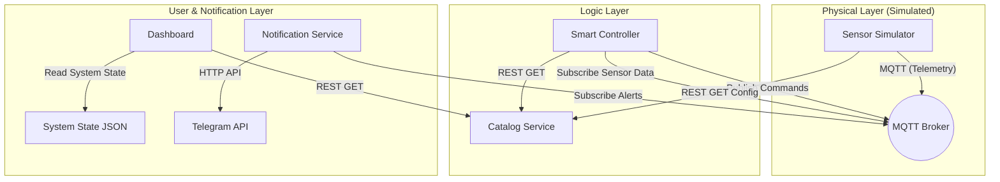

# 📘 RESTful IoT Smart Campus: Comprehensive Learning Guide

## 🎓 Introduction

Welcome to the **IoT Smart Campus Management Platform** learning guide. This project is a practical implementation of a **Microservices-based IoT Architecture**. It is designed to demonstrate how independent services communicate to monitor environment data and control building automation systems.

By exploring this project, you will learn:

- **Microservices Pattern**: How to split a complex system into small, focused services.
- **Service Discovery**: The role of a "Catalog" in dynamic systems.
- **IoT Communication**: Using **MQTT** for real-time telemetry and **REST APIs** for configuration.
- **Control Loops**: Implementing logic that reacts to sensor data.

---

## 🏗️ System Architecture

The system operates on a **Sensor-Controller-Actuator** feedback loop, supported by a central Catalog.



### Key Concepts

1.  **Decoupling**: The _Simulator_ doesn't know the _Controller_ exists. They only know about the **MQTT Broker**.
2.  **Centralized Configuration**: All services ask the **Catalog Service** for topics and settings. If you change a configuration in `catalog.json`, the whole system updates without changing code.

---

## 🧩 Component Deep Dive

### 1. Catalog Service (`/catalog`)

- **Role**: The "Phonebook" of the system.
- **Mechanism**: A simple server (CherryPy) that serves the `catalog.json` file.
- **Learning Point**: In real large-scale systems, this would be dynamic (services register themselves on startup). Here, it's a static registry for simplicity.

### 2. Sensor Simulator (`/simulator`)

- **Role**: Pretends to be physical hardware (Temperature sensors, CO2 sensors, Presence detectors).
- **Mechanism**: Reads `dummy_sensor_data.csv` line-by-line and publishes readings to MQTT topics like `iot/sensor/room1/temp`.
- **Learning Point**: How to mock hardware for testing IoT logic without buying sensors.

### 3. Smart Controller (`/controller`)

- **Role**: The "Brain". It contains the business logic.
- **Mechanism**:
  - Subscribes to sensor topics.
  - **Logic**: `IF room_occupied AND temp > 25 THEN turn_AC_on`.
  - Publishes commands to actuator topics like `iot/actuator/room1/hvac/set`.
- **Learning Point**: Separation of concerns. The controller acts on _data_, not hardware.

### 4. Notification Service (`/notification`)

- **Role**: The "Safety Net".
- **Mechanism**: Listens for critical events (or raw data exceeding thresholds) and pushes messages to Telegram.
- **Learning Point**: Integrating third-party APIs (Telegram) into an event-driven loop.

### 5. Dashboard (`/dashboard`)

- **Role**: The "Lens" for humans.
- **Mechanism**: Uses **Streamlit** to render `system_state.json` or listen to real-time data.
- **Learning Point**: Rapid UI prototyping for data-heavy applications.

---

## 🚀 Data Flow Walkthrough: "The Hot Room Scenario"

Let's trace what happens when Room 101 gets too hot:

1.  **Source**: `sensor_simulator.py` reads a row from CSV: `Room1, Temperature=28.5`.
2.  **Transmission**: Simulator publishes payload `{"room_id": "r1", "e": [{"n": "temperature", "v": 28.5}]}` to topic `iot/sensor/room1`.
3.  **Routing**: The MQTT Broker receives this and broadcasts it to all subscribers.
4.  **Processing**:
    - `smart_controller.py` receives the message.
    - It checks `catalog.json` to see the target temperature (e.g., 22.0°C).
    - Logic triggers: `28.5 > 22.0` -> **Cooling Needed**.
5.  **Action**: Controller publishes `{"command": "ON"}` to `iot/actuator/room1/hvac`.
6.  **Notification**: Steps happen in parallel. `notification_service.py` sees the high temp and sends a Telegram message: _"⚠️ Alert: Room 1 Temperature is 28.5°C!"_.
7.  **Feedback**: In a real system, the HVAC would turn on. Here, we update the `system_state.json` to show the AC is "ON".

---

## 🛠️ Learning Exercises

Ready to get your hands dirty? Try these challenges:

### Level 1: The Observer (Easy)

**Goal**: Change the simulation speed.

1.  Open `simulator/sensor_simulator.py`.
2.  Find the `time.sleep()` call in the main loop.
3.  Change it to make data arrive faster or slower.
4.  **Observe**: How does the Dashboard react? Does the Notification service spam you?

### Level 2: The Architect (Medium)

**Goal**: Add a new notification rule.

1.  Open `notification/notification_service.py`.
2.  Current logic likely checks for High Temperature.
3.  **Task**: Add logic to send a specialized alert if `CO2 > 800 ppm` (Poor Air Quality).
4.  **Hint**: You need to parse the incoming MQTT message for the "CO2" field.

### Level 3: The Creator (Hard)

**Goal**: Add a completely new room.

1.  Open `catalog/catalog.json`.
2.  Duplicate an existing room entry (e.g., "class1") and respond to it as "lab1".
3.  Add "lab1" data to `dummy_sensor_data.csv`.
4.  **Challenge**: Does the Controller automatically pick it up? (It should, if written dynamically). Functionality check!

### Level 4: The Operator (Dynamic Scaling)

**Goal**: Add a room _without_ touching the file manually.

1.  The system now supports **Dynamic Registration**.
2.  Use Postman or `curl` to send a POST request to `http://localhost:8080/add_room`.
    ```json
    {
      "room_id": "room_200",
      "mqtt_sensor_topic": "campus/room_200/sensors",
      ...
    }
    ```
3.  **Observe**: Watch the _Simulator_ terminal. Within 10 seconds, it should say `🆕 Found new/stopped room`.
4.  **Result**: The Dashboard will update instantly. This is **Zero-Downtime Deployment**.

### Level 5: The Architect (Systems Thinking)

**Goal**: Understand why we moved from "Static" to "Polling".

1.  **Old Way**: Simulator read the config _once_ at start. Adding a room required a restart.
2.  **New Way**: Simulator asks the Catalog "What rooms do you have?" every 10 seconds.
3.  **Trade-off**: Slightly more network traffic (1 tiny request every 10s) vs. Ability to scale instantly.
4.  **Question**: Why does the Dashboard _also_ need to reload the list? (Answer: Because UI state can become stale just like backend state).

---

## 📚 Recommended Reading

- **MQTT Essentials**: [HiveMQ Blog](https://www.hivemq.com/blog/mqtt-essentials-part-1-introducing-mqtt/)
- **Microservices**: [Martin Fowler on Microservices](https://martinfowler.com/articles/microservices.html)
- **Streamlit**: [Streamlit Docs](https://docs.streamlit.io/)
