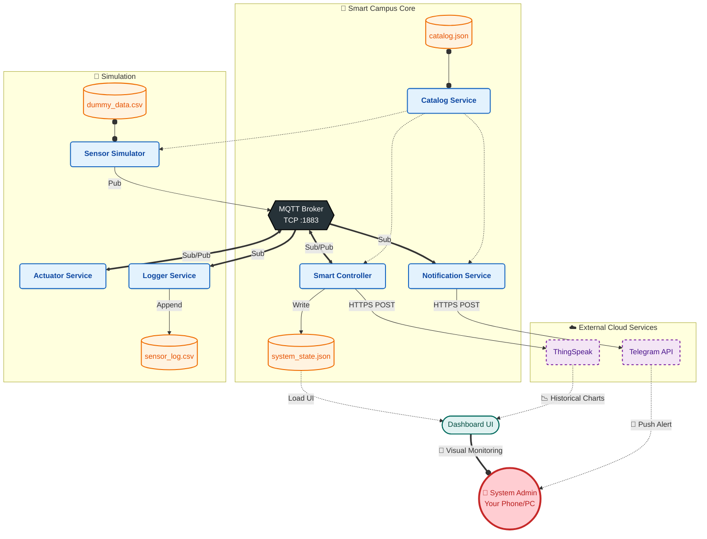

# Project Architecture & Data Flow Map

This document describes the connections, dependencies, and data flow of the IoT Smart Campus system.

## 1. System Overview

The system controls smart classroom environments (Lighting, Heating) based on Sensor Data (Occupancy, CO2, Light) and Rules.

**Core Services:**

1.  `catalog_service.py`: **Registry** (Stores configuration).
2.  `sensor_simulator.py`: **Inputs** (Generates fake sensor data from CSV).
3.  `controller_service.py`: **Brain** (Decides to turn lights ON/OFF).
4.  `notification_service.py`: **Alerts** (Sends Telegram Monitor).
5.  `dashboard.py`: **View** (Visualizes state).

---

## 2. File Connections (Source -> Destination)

| File                        | Connection                            | Usage                                                    |
| :-------------------------- | :------------------------------------ | :------------------------------------------------------- |
| **`catalog.json`**          | Read By -> `catalog_service.py`       | Loads initial room configs and API keys.                 |
| **`dummy_sensor_data.csv`** | Read By -> `sensor_simulator.py`      | Provides row-by-row sensor data for simulation.          |
| **`system_state.json`**     | Written By <- `controller_service.py` | Controller saves the current snapshot of all rooms here. |
| **`system_state.json`**     | Read By -> `dashboard.py`             | Dashboard reads this file every second to update the UI. |
| **`secrets.json`**          | Read By -> `notification_service.py`  | Load Telegram Bot Tokens.                                |

---

## 3. Communication & Data Flow

### Step 1: Configuration (The Setup)

- **Startup**: All services (`sim`, `ctrl`, `notif`) send a **HTTP GET** request to `http://localhost:8080` (Catalog) to get the list of rooms and the MQTT Broker address.

### Step 2: Sensing (The Input & Dynamic Discovery)

- **Simulator Loop (Every 10s)**:
  - Queries `http://localhost:8080/rooms` to see if new rooms have been added.
  - If a new room is found, it spawns a **new thread** for it.
- **Data Generation**:
  - Reads `Temp=22, Occ=1` from CSV.
- **Transmission**:
  - Sends **MQTT Message** to topic: `campus/room_101/sensors`.

### Step 3: Logic (The Controller)

- **Controller** receives the message via MQTT.
- **Logic**:
  - _If Occupancy == 1 AND Light < 300 -> Turn Lights ON._
- **Action 1**: Controller sends **MQTT Message** to `campus/room_101/actuators` (Lights: ON).
- **Action 2**: Controller writes status to `system_state.json`.
- **Action 3**: Controller sends data to **ThingSpeak Cloud** (HTTP).

### Step 4: Alerting (The Notification Service)

- **Notification Service** receives the same MQTT Sensor message.
- **Logic**:
  - _If CO2 > 1500 -> Critical Alert._
- **Action**: Sends **HTTP POST** to **Telegram API**.

### Step 5: Visualization (The Dashboard)

- **Dashboard** continuously reads `system_state.json`.
- Updates the UI: Shows "Occupied" icon and "Lights ON".
- Embeds **ThingSpeak Iframe** for historical charts.

---

## 4. Visual Diagram (Mermaid)



## 5. Connectivity Reference (ASCII)

```text
+---------------------+       HTTP GET (:8080)      +-------------------+
|   Catalog Service   | <-------------------------- | All Other Services|
+---------------------+                             +-------------------+
          ^
          | Reads
   [catalog.json]

       +-------------------------+
       |      MQTT Broker        |
       |  (localhost:1883)       |
       +-----------+-------------+
                   ^
        Pub/Sub    |
   +---------------+---------------+
   |               |               |               |
   |               |               |               |
[Simulator]   [Controller]   [Notification]   [Actuator] --- [Logger]
   |               |               |               |             |
Reads CSV       Writes JSON      Sends TG       Pub Status    Writes CSV
                   |
            [system_state.json]
                   |
              [Dashboard]
```

## 6. Port & Protocol Matrix

| Source Service   | Target Service  | Protocol | Port   | Purpose                                 |
| :--------------- | :-------------- | :------- | :----- | :-------------------------------------- |
| **Any Service**  | **Catalog**     | HTTP     | `8080` | Fetch configuration/settings.           |
| **Simulator**    | **MQTT Broker** | MQTT     | `1883` | Publish sensor data.                    |
| **Controller**   | **MQTT Broker** | MQTT     | `1883` | Subscribe to sensors, Publish commands. |
| **Notification** | **MQTT Broker** | MQTT     | `1883` | Subscribe to sensors/alerts.            |
| **Controller**   | **ThingSpeak**  | HTTPS    | `443`  | Cloud data logging.                     |
| **Notification** | **Telegram**    | HTTPS    | `443`  | Send user alerts.                       |
| **Dashboard**    | **FileSystem**  | File I/O | N/A    | Read `system_state.json`.               |
| **Browser**      | **Dashboard**   | HTTP     | `8501` | User Interface (Streamlit).             |
