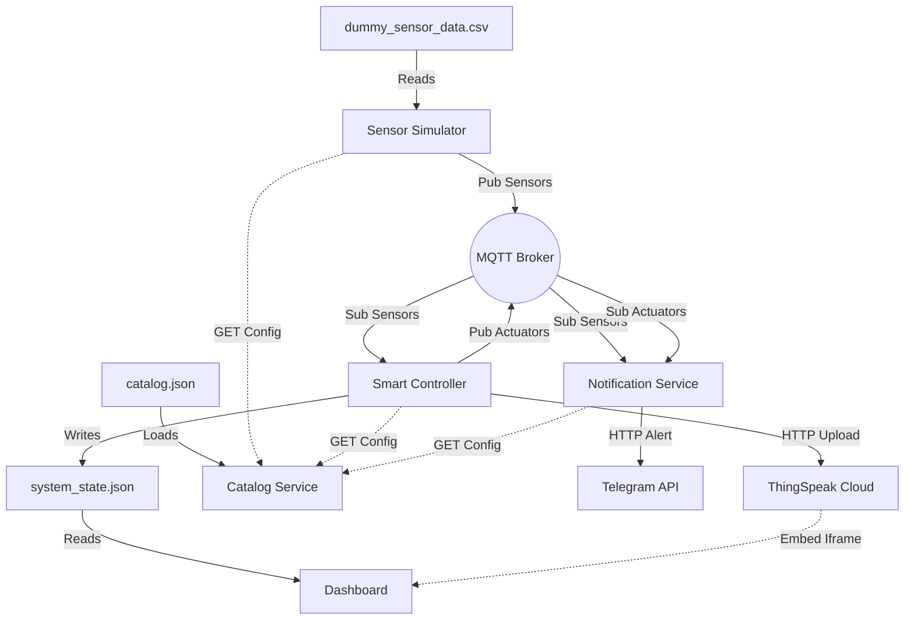

# IoT Smart Campus Management Platform (Group 5)

## Overview

An IoT-based Smart Campus Management Platform designed to monitor environmental conditions (CO2, Temperature) and occupancy across multiple rooms. The system automatically controls lighting and heating systems to improve energy efficiency and user comfort, while keeping administrators informed via real-time Telegram alerts.

## Architecture

The system follows a microservice-based IoT architecture:

- **Physical Layer (Simulated)**: Virtual sensors and actuators using Kaggle datasets to simulate real-world building data.
- **Data & Logic Layer**: A **Smart Controller** that processes sensor data to make intelligent decisions (e.g., turning off lights in empty rooms).
- **User Awareness Layer**:
  - **Dashboard**: A Streamlit-based web interface for real-time monitoring.
  - **Notification Service**: A Telegram bot for instant alerts on critical events (e.g., High CO2).
- **Communication**: MQTT for real-time telemetry, REST APIs for service discovery and configuration.

### System Diagram



### 📖 How to Read This Diagram

- **Solid Arrows (-->)**: Real-time data flowing constantly (e.g., Sensor readings).
- **Dotted Arrows (-.->)**: One-time requests (e.g., asking "What rooms exist?" at startup).
- **Cylinders**: Files where data is stored.
- **Rectangles**: The Python programs running the system.

### 🔄 The Data Journey (Example)

1.  **Sensing**: The `Simulator` reads "Temperature: 22°C" from the CSV file.
2.  **Transport**: It sends this data to the `MQTT Broker` (the post office of the system).
3.  **Decision**: The `Controller` picks up the message, sees someone is in the room, and decides to turn the **Lights ON**.
4.  **Notification**: At the same time, the `Notification Service` checks the air quality. If CO2 is high, it messages you on **Telegram**.
5.  **Visualization**: The `Dashboard` reads the latest state and updates the screen so you can see it live.

## Components

| Component                | Directory       | Description                                                  |
| ------------------------ | --------------- | ------------------------------------------------------------ |
| **Catalog Service**      | `/catalog`      | Central registry for all services, rooms, and devices.       |
| **Smart Controller**     | `/controller`   | The brain of the system; manages logic for lights and HVAC.  |
| **Sensor Simulator**     | `/simulator`    | Replays recorded sensor data (CSV) to pose as real hardware. |
| **Notification Service** | `/notification` | Bridges MQTT alerts to a Telegram Bot.                       |
| **Dashboard**            | `/dashboard`    | Visualizes system state using Streamlit.                     |

## Installation & Setup

### 1. Prerequisites

- **Python 3.8+**
- **MQTT Broker**: You need an MQTT broker (like Mosquitto) running on port `1883`.
  - _Windows_: Download and install [Mosquitto](https://mosquitto.org/download/).
  - _Linux/Mac_: `sudo apt install mosquitto` / `brew install mosquitto`.

### 2. Install Dependencies

```bash
pip install -r requirements.txt
```

### 3. Configuration (Critical)

You must set up your Telegram credentials for notifications to work.

1.  Create a file named `secrets.json` inside the `notification/` folder.
2.  Add your Telegram Bot Token and Chat ID:
    ```json
    {
      "TELEGRAM_BOT_TOKEN": "your_bot_token_here",
      "CHAT_ID": "your_chat_id_here"
    }
    ```

## Usage

### One-Click Start

We provide a batch script to launch all microservices (Catalog, Controller, Notification, Simulator, Dashboard) automatically:

```cmd
start_system.bat
```

### Manual Start

If you prefer to run services individually, open separate terminals for each:

1.  **Catalog**: `python catalog/catalog_service.py`
2.  **Controller**: `python controller/controller_service.py`
3.  **Notification**: `python notification/notification_service.py`
4.  **Simulator**: `python simulator/sensor_simulator.py`
5.  **Dashboard**: `streamlit run dashboard/dashboard.py`
